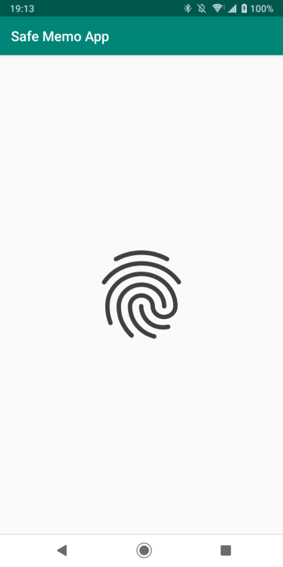
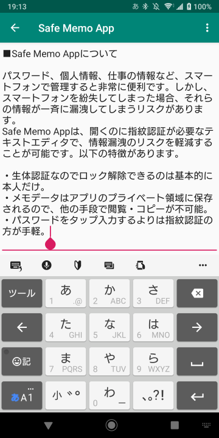

# Safe Memo App

## 概要

- パスワード、個人情報、仕事の情報など、スマートフォンで管理すると非常に便利です。しかし、スマートフォンを紛失してしまった場合、それらの情報が一斉に漏洩してしまうリスクもあります。
- Safe Memo Appは、開くのに指紋認証が必要なテキストエディタで、情報漏洩のリスクを軽減することが可能です。以下の特徴があります。
  - 生体認証なのでロック解除できるのは基本的に本人だけ。
  - メモデータはアプリのプライベート領域に保存されているので、他の手段で閲覧・コピーが不可能。
  - パスワードをタップ入力するよりは指紋認証のほうが手軽。

## 動作環境

- Android 6 (Android API Level 23) 以上。

## インストール

- githubのreleasesのページからダウンロードできます。パッケージファイル (SafeMemoApp.apk) のリンクをタップすると、インストールパッケージがダウンロードされ、Androidにインストールしていいか確認を行います。
- アンインストールはAndroidアプリの標準的なアンインストール操作と同じです。
- Google Playに登録していない野良アプリです。自己責任でお願いします。

## 使い方

### 認証画面

- 指紋認証をする画面。
- androidの機能として、短時間に複数回認証失敗すると、一定時間ロックがかかります。

### メモ入力画面

- 単純なテキストエディタ。
- テキストが保存されるタイミングは、前の画面に戻る時、ウィンドウを閉じる時、ウィンドウがバックグラウンドに移動した時、など。

## 既知の問題点

- メモ内容のエクスポート、インポートの機能がありません。（実装予定あり）
  - テキストを「すべて選択」して表示されるメニュー項目「共有」を使えば、エクスポートは今でも可能です。
- 試作版なので1つのファイルしか扱えません。（複数のファイルを扱えるように修正する予定あり）
- 検索・置換などの基本的なテキストエディタの機能がないです。（実装するかも？）

## バージョン履歴

- 2019/03/24 SafeMemoApp v1.00

## 著作権

- RakugakiAppの全ての配布物は「zlib/libpngライセンス」を適用します。
- (C) 2019 aktera.
